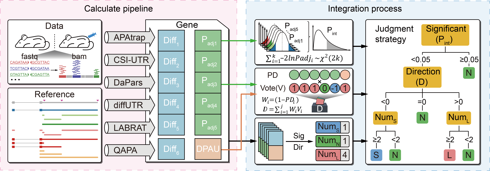

# FIAAU
We have integrated the processes and results of APAtrap, CSI-UTR, DaPars, diffUTR, LABRAT, and QAPA methods, and proposed the FIAAU (Framework for integrated analysis of alternative 3'UTR) based on Fisher transformation and weighted voting for dynamic change identification of 3' UTR.



## Installation
The installation process requires `Perl` and `Conda`, so you need to install them first.

### Create Environment with Conda
First, download the repository and create the environment.

```
git clone https://github.com/cqz7633/FIAAU.git
cd ./FIAAU/install
conda env create -f environment.yml
```

Then, activate the "FIAAU" environment.

```
conda activate FIAAU
```

### Install Perl package and local R package
We have compiled a simple installation bash script, please run it directly.

```
bash install.sh
```

## Prepare annotation files and samples information files

### 1. Mouse annotation(mm10) of methods

We provide annotation files for the 3'UTR of mouse mm10 required for APAtrap, CSI-UTR, DaPars, diffUTR, LABRAT, and QAPA. This annotation is based on the integration of GENCODE and PolyA_DB3 databases and can be downloaded from [Google Drive](https://drive.google.com/file/d/1ki3yKC0YcGy36pWV0XFleV3_Za3rh7aQ/view?usp=drive_link).
After downloading and decompressing, move the `mm10` directory and all files to the `/FIAAU/anno`. The file structure is provided as below:
```
FIAAU/  
└── anno  
   └── mm10  
       ├── apatrap_3utr.bed  
       ├── apatrap_anno.bed  
       ├── csi_anno.bed  
       ├── csi.bed  
       ├── dapars_anno.bed  
       ├── diffutr_anno.bed  
       ├── labrat_anno.addhead.gff3  
       ├── labrat_anno.addhead.gff3.db  
       ├── mm10.chrom.sizes  
       ├── mm10.fa  
       ├── mm10.fa.fai  
       ├── qapa_anno.bed  
       ├── qapa_ident.txt  
       └── TFseqs.fasta
```

### 2. Samples information files

The pipeline requires `FastQ` and `BAM` files as inputs, so we need to create two separate files to provide their locations and corresponding sample information. Please note that the sample information file does not require a header.

#### FastQ information file
The sample file of FastQ, the first column is the absolute path of the FastQ file. If it is `pair-end` data, the `R1` and `R2` files of each sample are arranged together. The second column is sample information, used to provide control and treatment group information in the FastQ files.

The FastQ sample file is provided as below:

| column1| column2 |
|--------|---------|
| /path/control_re1_r1.fq.gz | control |
| /path/control_re1_r2.fq.gz | control |
| /path/control_re2_r1.fq.gz | control |
| /path/control_re2_r2.fq.gz | control |
| /path/treatment_re1_r1.fq.gz | treatment |
| /path/treatment_re1_r2.fq.gz | treatment |
| /path/treatment_re2_r1.fq.gz | treatment |
| /path/treatment_re2_r2.fq.gz | treatment |

#### BAM information file
The sample file of FastQ, the first column is the absolute path of the BAM file. The second column is sample information, used to provide control and treatment group information in the BAM files.

The BAM sample file is provided as below:

| column1| column2 |
|--------|---------|
| /path/control_re1.bam| control |
| /path/control_re2.bam | control |
| /path/treatment_re1.bam | treatment |
| /path/treatment_re2.bam | treatment |

## Run FIAAU pipline
